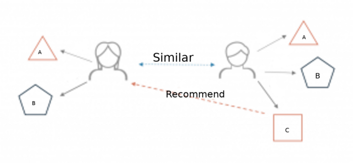

## Simple-Movie-Recomender-System

### What is a recommender system?

A recommender system is a simple algorithm whose aim is to provide the most relevant information to a user by discovering patterns in a dataset. The algorithm rates the items and shows the user the items that they would rate highly. An example of recommendation in action is when you visit Amazon and you notice that some items are being recommended to you or when Netflix recommends certain movies to you.

A very simple illustration of how recommender systems work in the context of an e-commerce site.

Two users buy the same items A and B from an ecommerce store. When this happens the similarity index of these two users is computed. Depending on the score the system can recommend item C to the other user because it detects that those two users are similar in terms of the items they purchase.
